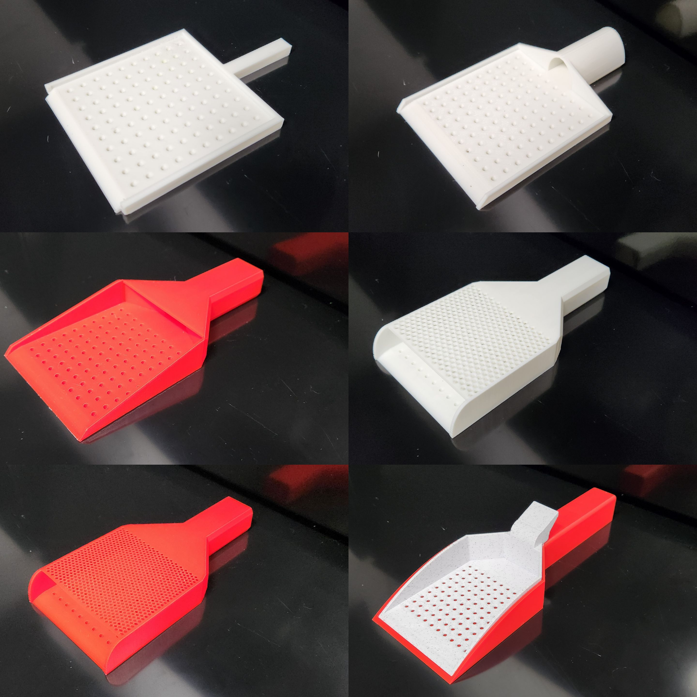

# 3D Printed Tools

<figure class="image">
    

        
        
    

</figure>

Numerous activities in the plant sciences require time-consuming, repetitive actions that are ideal for automation, but existing tools to accomplish these types of tasks are often priced beyond the reach of many research labs, especially in low-resource environments.
We developed a suite of easy-to-use, 3D-printable tools that were created using accessible software and have been tested for speed and accuracy across multiple crops.
These 3D-printed tools shorten the time needed for specific research activities and cost less than 15% of commercial counterparts.
Each directory in this repository contains a specific 3D printed tool.
Model subdirectories contain files with paramaters that can be adjusted to meet specific needs and STL directories contain files that can be directly printed without any additional customization.
All designs are freely available under a CC-BY-SA license.