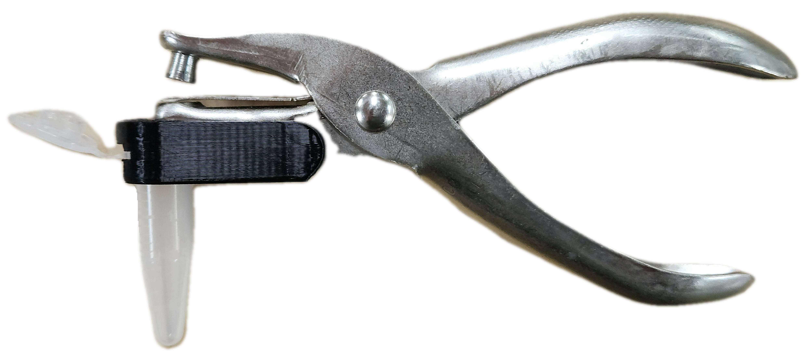
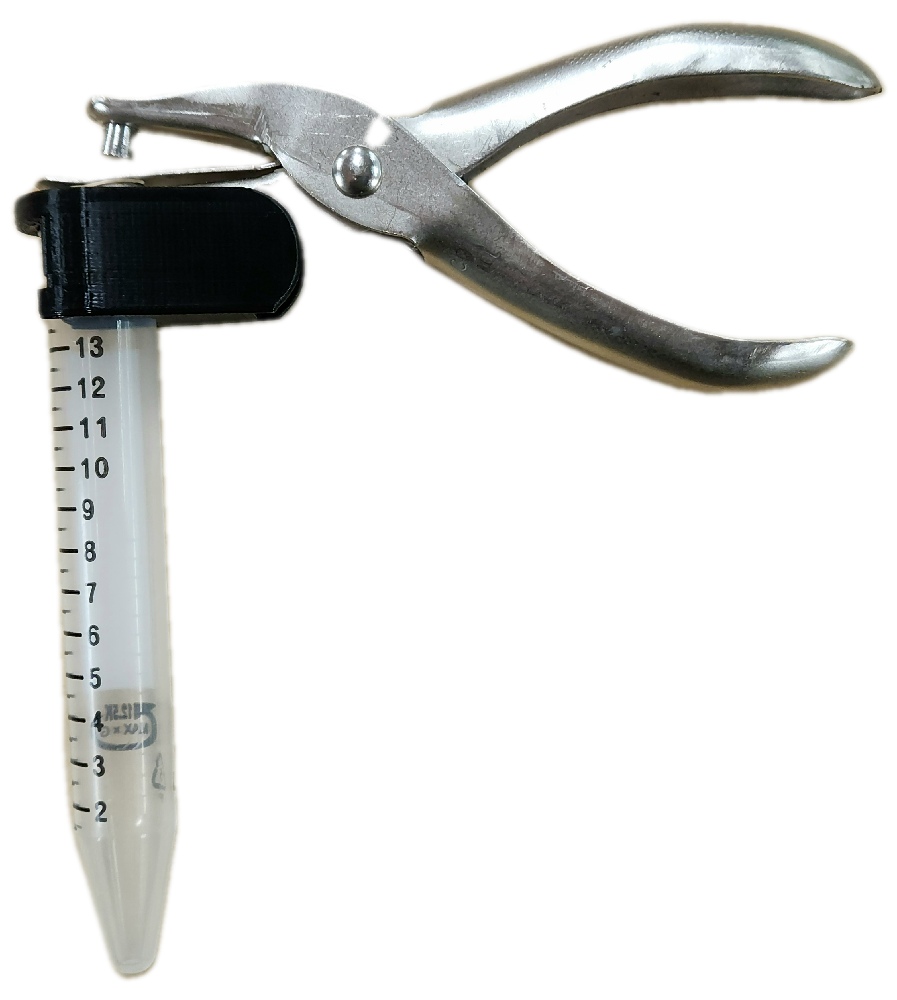

# Tube Adapter

<figure class="image">
    

        
        
    

</figure>

This model is a fully parametric hole punch adapter that attaches to most generic, 0.25 inch, single-hole punches.
To adapt this model for specific tubes, measure the `FlangeWidth`, `FlangeHeight`, `TubeDiameter`, `ThreadedPartHeight`, and `ThreadedPartWidth`.

## Parameters

| Parameter Name | Suggested Value/Range | Notes |
| -------------- | --------------------- | ----- |
| `WallThickness` | 3mm | Thickness of the tube wall; can be found in the manufacturers item specifications |
| `Tolerance` | 0.3mm | Adjust based on your printer's limitations |
| `Tube_Diameter` |	10.2mm (1.5/2mL), 17mm (15mL) |	Diameter of the tube at its widest point not including the flange |
| `Flange_Height` | 1.5mm (all tube types) | Adjust to increase/decrease grip for specific tube types or decrease tube wobbling during use
| `Flange_Width`	| 12.7mm (1.5/2mL), 18.9mm (15mL)	| Diameter of the widest part of the tube
| `ThreadedPart_Height`	| 6mm (screw-cap 1.5/2/15mL), 1mm (flip top 1.5/2mL) | Adjust depending on general tube type
| `ThreadedPart_Width`	| 6mm (1.5/2mL), 18.9mm (15mL) | Diameter of the tube including the threads for the screw-cap
| `HolePunchWallThickness` | 1 mm + ( 0.5 * Tolerance ) | Only adjust the first number to ensure proper fit |

<figure class="image">
    

        
        
    

</figure>
