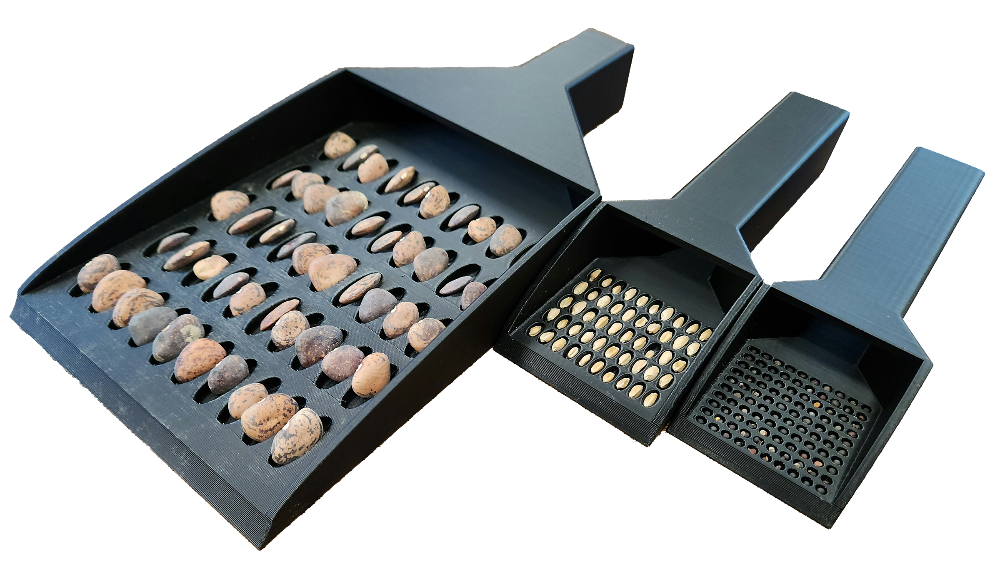

# Seed Tray

<figure class="image">
    

        
        
    

</figure>

Manual seed counting is slow, prone to human error, and is a significant bottleneck to breeding throughput.
This model maximizes count accuracy, ease of use, and utility.
The handle is hollow to easily allow seeds to be transferred to an envelope or bag for storage or distribution.
The front of the tray is beveled to minimize damage to seeds when scooping and the edges of the seed holes are beveled to minimize stuck seeds.
The Size Testers can be used to determine your optimal hole size.
We have included a number of generally-sized trays that worked for a number of genotypes we tested.

## Parameters

| Parameter Name     | Suggested Value/Range | Notes |
| ------------------ | --------------------- | ----- |
| `WallThickness` | 3mm | Thickness of the walls of the tray; useful if you need a stronger print |
| `X_Count` | 1-100                 | Multiply this value by `Y_Count` to determine the number of seeds your tray can hold |
| `Y_Count` | ≤ 15                  | Multiply this value by `X_Count` to determine the number of seeds your tray can hold |
| `HoleSpacingWidth` | HoleRX * 2.5 | The space between each hole in the tray; used to move the holes closer or further apart; adjust the number not the variable name |
| `HoleSpacingLength` | HoleRY * 2.5 | The space between each hole in the tray; used to move the holes closer or further apart; adjust the number not the variable name |
| `HoleBodyDepth` | ( 0.5 ) * HoleRadiusX | Often should be equal to `HoleBottomDepth`; useful for adjusting for non-round seeds |
| `HoleBottomDepth` | ( 0.5 ) * HoleRadiusX | Often should be equal to `HoleBodyDepth`; useful for adjusting for non-round seeds |
| `HandWidth` | 20mm | Base this value on the size of your grip when holding something like broom handle |
| `HandLength` | 100mm |Easiest way to adjust the tray to fit your printer |
| `HoleDiameterWidth` | 0.2-7.0mm | Use the seed sizing squares or calipers to determine this value |
| `HoleDiameterLength` | 0.2-7.0mm | Use the seed sizing squares or calipers to determine this value |
