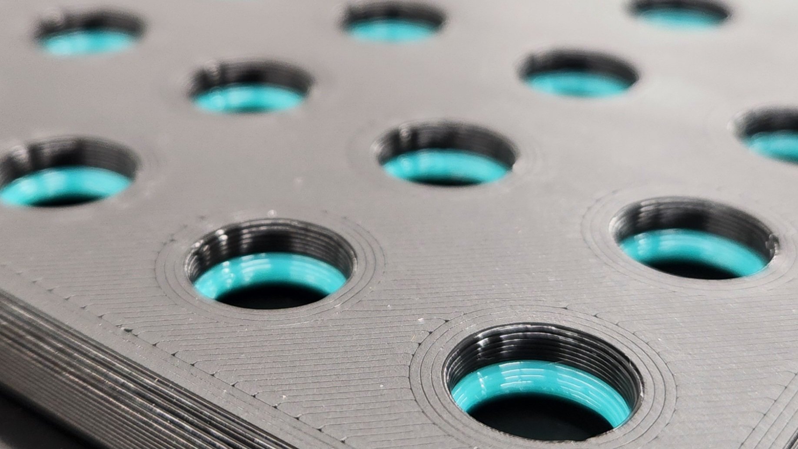
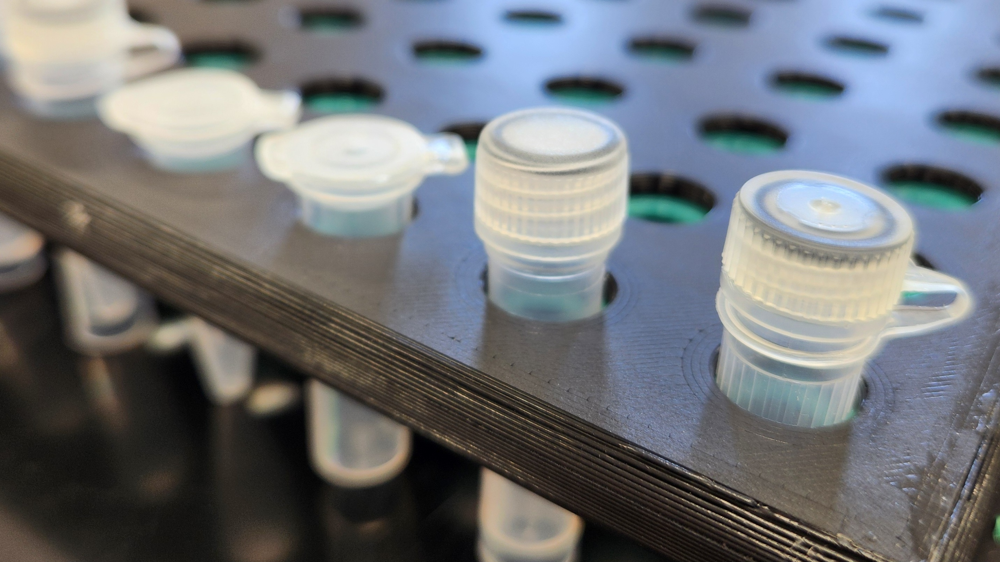

# Tube Holder

The NeverDrop tube holder is a solution for keeping tubes organized during field work to avoid misplacement, damage, and time loss.
It can adjusted to hold as many tubes as needed and is built with a handle for holding or to clip to a belt or bag.
The gasket is printed out of a flexible filament (e.g. Flexible PLA, TPU, TPE, or PEBA) while the frame can be printed out of any rigid filament.

## Insructions

Print the gasket first.
When slicing the frame, add a pause to the print just before the bridging layer.
Insert the flexible gasket so that the top is entirely flush, then resume the print.
The dimensions of the holder are only limited by the maximum X and Y dimensions of your printer and can be easily adjusted using the parameters below.

<figure class="image">
    

        
        
    

</figure>

## Parameters

| Parameter Name | Suggested Value/Range | Notes |
| -------------- | --------------------- | ----- |
| `TubeDiameter` | 10.6mm | See below for what to measure |
| `TubeRidgeHeight` | 1.2mm | RefeSee below for what to measure |
| `Tolerance` | 0.4mm | Adjust based on your printer's limitations |
| `X_Count` | 1-∞ | We don't suggest going above 10 |
| `Y_Count` | 1-∞ | We don't suggest going above 20 |
| `GasketHeight` | 2.4mm | This can be printed thinner, but 2.4mm yielded the best grip in our tests |
| `HandleWidth` | 10mm | Adjust to fit your hand, carabiner, belt, etc. |

